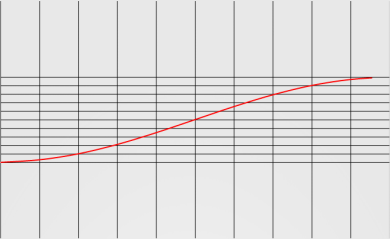
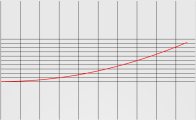
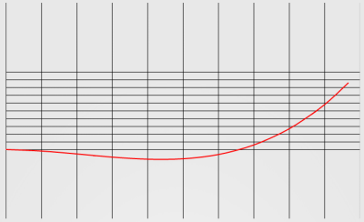
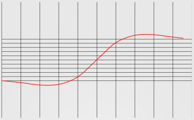
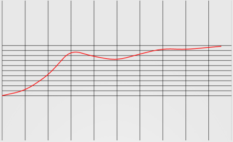
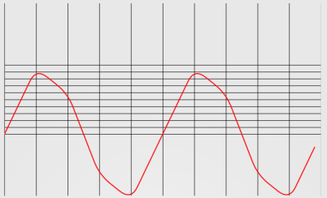
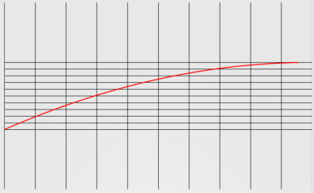
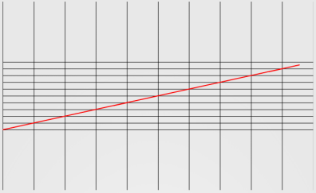
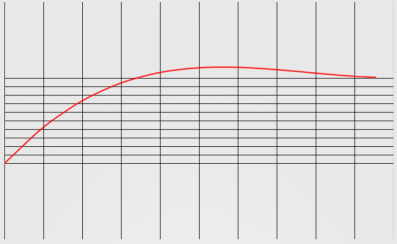

forked from mengdd/HelloInterpolator
https://github.com/mengdd/HelloInterpolator
Demo project to show the of the math curve of the Android's Interpolator class used in Animation.


## Android中的Interpolator

转自:
http://www.cnblogs.com/mengdd/p/3346003.html

Interpolator用于动画中的时间插值，其作用就是把0到1的浮点值变化映射到另一个浮点值变化。
本文列出Android API提供的Interpolator的若干种实现，列出源码，并且用一个程序绘制出其数学曲线。（项目链接附在文后）。

### 1、AccelerateDecelerateInterpolator

```java
/**
 * An interpolator where the rate of change starts and ends slowly but
 * accelerates through the middle.
 *
 */
public class AccelerateDecelerateInterpolator implements Interpolator {
    public AccelerateDecelerateInterpolator() {
    }
   
    @SuppressWarnings({"UnusedDeclaration"})
    public AccelerateDecelerateInterpolator(Context context, AttributeSet attrs) {
    }
   
    public float getInterpolation(float input) {
        return (float)(Math.cos((input + 1) * Math.PI) / 2.0f) + 0.5f;
    }
}
```


### 2、AccelerateInterpolator

```java
/**
 * An interpolator where the rate of change starts out slowly and
 * and then accelerates.
 *
 */
public class AccelerateInterpolator implements Interpolator {
    private final float mFactor;
    private final double mDoubleFactor;

    public AccelerateInterpolator() {
        mFactor = 1.0f;
        mDoubleFactor = 2.0;
    }
   
    /**
     * Constructor
     *
     * @param factor Degree to which the animation should be eased. Seting
     *        factor to 1.0f produces a y=x^2 parabola. Increasing factor above
     *        1.0f  exaggerates the ease-in effect (i.e., it starts even
     *        slower and ends evens faster)
     */
    public AccelerateInterpolator(float factor) {
        mFactor = factor;
        mDoubleFactor = 2 * mFactor;
    }
   
    public AccelerateInterpolator(Context context, AttributeSet attrs) {
        TypedArray a =
            context.obtainStyledAttributes(attrs, com.android.internal.R.styleable.AccelerateInterpolator);
       
        mFactor = a.getFloat(com.android.internal.R.styleable.AccelerateInterpolator_factor, 1.0f);
        mDoubleFactor = 2 * mFactor;

        a.recycle();
    }
   
    public float getInterpolation(float input) {
        if (mFactor == 1.0f) {
            return input * input;
        } else {
            return (float)Math.pow(input, mDoubleFactor);
        }
    }
}
```


### 3、AnticipateInterpolator

```java
/**
 * An interpolator where the change starts backward then flings forward.
 */
public class AnticipateInterpolator implements Interpolator {
    private final float mTension;

    public AnticipateInterpolator() {
        mTension = 2.0f;
    }

    /**
     * @param tension Amount of anticipation. When tension equals 0.0f, there is
     *                no anticipation and the interpolator becomes a simple
     *                acceleration interpolator.
     */
    public AnticipateInterpolator(float tension) {
        mTension = tension;
    }

    public AnticipateInterpolator(Context context, AttributeSet attrs) {
        TypedArray a = context.obtainStyledAttributes(attrs,
                com.android.internal.R.styleable.AnticipateInterpolator);

        mTension =
                a.getFloat(com.android.internal.R.styleable.AnticipateInterpolator_tension, 2.0f);

        a.recycle();
    }

    public float getInterpolation(float t) {
        // a(t) = t * t * ((tension + 1) * t - tension)
        return t * t * ((mTension + 1) * t - mTension);
    }
}
```



### 4、AnticipateOvershootInterpolator

```java
/**
 * An interpolator where the change starts backward then flings forward and overshoots
 * the target value and finally goes back to the final value.
 */
public class AnticipateOvershootInterpolator implements Interpolator {
    private final float mTension;

    public AnticipateOvershootInterpolator() {
        mTension = 2.0f * 1.5f;
    }

    /**
     * @param tension Amount of anticipation/overshoot. When tension equals 0.0f,
     *                there is no anticipation/overshoot and the interpolator becomes
     *                a simple acceleration/deceleration interpolator.
     */
    public AnticipateOvershootInterpolator(float tension) {
        mTension = tension * 1.5f;
    }

    /**
     * @param tension Amount of anticipation/overshoot. When tension equals 0.0f,
     *                there is no anticipation/overshoot and the interpolator becomes
     *                a simple acceleration/deceleration interpolator.
     * @param extraTension Amount by which to multiply the tension. For instance,
     *                     to get the same overshoot as an OvershootInterpolator with
     *                     a tension of 2.0f, you would use an extraTension of 1.5f.
     */
    public AnticipateOvershootInterpolator(float tension, float extraTension) {
        mTension = tension * extraTension;
    }

    public AnticipateOvershootInterpolator(Context context, AttributeSet attrs) {
        TypedArray a = context.obtainStyledAttributes(attrs, AnticipateOvershootInterpolator);

        mTension = a.getFloat(AnticipateOvershootInterpolator_tension, 2.0f) *
                a.getFloat(AnticipateOvershootInterpolator_extraTension, 1.5f);

        a.recycle();
    }

    private static float a(float t, float s) {
        return t * t * ((s + 1) * t - s);
    }

    private static float o(float t, float s) {
        return t * t * ((s + 1) * t + s);
    }

    public float getInterpolation(float t) {
        // a(t, s) = t * t * ((s + 1) * t - s)
        // o(t, s) = t * t * ((s + 1) * t + s)
        // f(t) = 0.5 * a(t * 2, tension * extraTension), when t < 0.5
        // f(t) = 0.5 * (o(t * 2 - 2, tension * extraTension) + 2), when t <= 1.0
        if (t < 0.5f) return 0.5f * a(t * 2.0f, mTension);
        else return 0.5f * (o(t * 2.0f - 2.0f, mTension) + 2.0f);
    }
}
```



### 5、BounceInterpolator

```java
/**
 * An interpolator where the change bounces at the end.
 */
public class BounceInterpolator implements Interpolator {
    public BounceInterpolator() {
    }

    @SuppressWarnings({"UnusedDeclaration"})
    public BounceInterpolator(Context context, AttributeSet attrs) {
    }

    private static float bounce(float t) {
        return t * t * 8.0f;
    }

    public float getInterpolation(float t) {
        // _b(t) = t * t * 8
        // bs(t) = _b(t) for t < 0.3535
        // bs(t) = _b(t - 0.54719) + 0.7 for t < 0.7408
        // bs(t) = _b(t - 0.8526) + 0.9 for t < 0.9644
        // bs(t) = _b(t - 1.0435) + 0.95 for t <= 1.0
        // b(t) = bs(t * 1.1226)
        t *= 1.1226f;
        if (t < 0.3535f) return bounce(t);
        else if (t < 0.7408f) return bounce(t - 0.54719f) + 0.7f;
        else if (t < 0.9644f) return bounce(t - 0.8526f) + 0.9f;
        else return bounce(t - 1.0435f) + 0.95f;
    }
}
```

 

### 6、CycleInterpolator


```java
/**
 * Repeats the animation for a specified number of cycles. The
 * rate of change follows a sinusoidal pattern.
 *
 */
public class CycleInterpolator implements Interpolator {
    public CycleInterpolator(float cycles) {
        mCycles = cycles;
    }
   
    public CycleInterpolator(Context context, AttributeSet attrs) {
        TypedArray a =
            context.obtainStyledAttributes(attrs, com.android.internal.R.styleable.CycleInterpolator);
       
        mCycles = a.getFloat(com.android.internal.R.styleable.CycleInterpolator_cycles, 1.0f);
       
        a.recycle();
    }
   
    public float getInterpolation(float input) {
        return (float)(Math.sin(2 * mCycles * Math.PI * input));
    }
   
    private float mCycles;
}
```

参数为2时的曲线：

 


### 7、DecelerateInterpolator

```java
/**
 * An interpolator where the rate of change starts out quickly and
 * and then decelerates.
 *
 */
public class DecelerateInterpolator implements Interpolator {
    public DecelerateInterpolator() {
    }

    /**
     * Constructor
     *
     * @param factor Degree to which the animation should be eased. Setting factor to 1.0f produces
     *        an upside-down y=x^2 parabola. Increasing factor above 1.0f makes exaggerates the
     *        ease-out effect (i.e., it starts even faster and ends evens slower)
     */
    public DecelerateInterpolator(float factor) {
        mFactor = factor;
    }
   
    public DecelerateInterpolator(Context context, AttributeSet attrs) {
        TypedArray a =
            context.obtainStyledAttributes(attrs, com.android.internal.R.styleable.DecelerateInterpolator);
       
        mFactor = a.getFloat(com.android.internal.R.styleable.DecelerateInterpolator_factor, 1.0f);
       
        a.recycle();
    }
   
    public float getInterpolation(float input) {
        float result;
        if (mFactor == 1.0f) {
            result = (float)(1.0f - (1.0f - input) * (1.0f - input));
        } else {
            result = (float)(1.0f - Math.pow((1.0f - input), 2 * mFactor));
        }
        return result;
    }
   
    private float mFactor = 1.0f;
}
```


 
### 8、LinearInterpolator

```java
/**
 * An interpolator where the rate of change is constant
 *
 */
public class LinearInterpolator implements Interpolator {

    public LinearInterpolator() {
    }
   
    public LinearInterpolator(Context context, AttributeSet attrs) {
    }
   
    public float getInterpolation(float input) {
        return input;
    }
}
```


 
### 9、OvershootInterpolator

```java
/**
 * An interpolator where the change flings forward and overshoots the last value
 * then comes back.
 */
public class OvershootInterpolator implements Interpolator {
    private final float mTension;

    public OvershootInterpolator() {
        mTension = 2.0f;
    }

    /**
     * @param tension Amount of overshoot. When tension equals 0.0f, there is
     *                no overshoot and the interpolator becomes a simple
     *                deceleration interpolator.
     */
    public OvershootInterpolator(float tension) {
        mTension = tension;
    }

    public OvershootInterpolator(Context context, AttributeSet attrs) {
        TypedArray a = context.obtainStyledAttributes(attrs,
                com.android.internal.R.styleable.OvershootInterpolator);

        mTension =
                a.getFloat(com.android.internal.R.styleable.OvershootInterpolator_tension, 2.0f);

        a.recycle();
    }

    public float getInterpolation(float t) {
        // _o(t) = t * t * ((tension + 1) * t + tension)
        // o(t) = _o(t - 1) + 1
        t -= 1.0f;
        return t * t * ((mTension + 1) * t + mTension) + 1.0f;
    }
}
```


 
项目链接：
https://github.com/mengdd/HelloInterpolator.git


